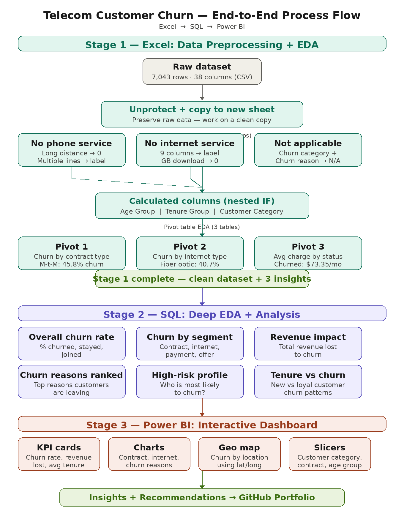

# 📊 Telecom Customer Churn Analysis
### End-to-End Analytics Project | Excel · SQL · Power BI



---

## 🗂️ Project Overview

This project performs a full end-to-end customer churn analysis for a telecom company using three industry-standard tools. The analysis follows a complete data pipeline — from raw data preprocessing to deep SQL querying to an interactive Power BI dashboard — telling a complete business story in 3 pages.

> **The dashboard answers 3 critical questions:**
> - 📌 **Page 1:** What is happening?
> - 📌 **Page 2:** Why is it happening?
> - 📌 **Page 3:** Who is at risk and what does it cost?

---

## 🛠️ Tools & Technologies

| Tool | Purpose |
|------|---------|
| Microsoft Excel | Data preprocessing, calculated columns, pivot table EDA |
| MySQL 8.0 | Deep exploratory data analysis — 13 SQL queries |
| Power BI Desktop | 3-page interactive dashboard |

---

## 📁 Dataset

| Attribute | Detail |
|-----------|--------|
| Source | Telecom Customer Churn Dataset |
| Period | Q2 2022 — California, USA |
| Total Records | 7,043 customers |
| Total Columns | 41 columns (including engineered features) |
| Target Variable | Customer Status (Churned / Stayed / Joined) |
| Overall Churn Rate | 26.54% |

---

## 🔄 Project Pipeline

```
Raw CSV Data
     ↓
Stage 1 — Excel
• Unprotect & copy to clean sheet
• Handle missing values (3 groups)
• Create Age Group column (nested IF)
• Create Tenure Group column (nested IF)
• Create Customer Category column (nested IF)
• Pivot Table EDA (3 tables)
     ↓
Stage 2 — MySQL
• Import cleaned CSV via LOAD DATA INFILE
• 13 SQL queries for deep EDA
• Churn rate calculations across 10 dimensions
• Revenue impact analysis
• High risk customer profiling
     ↓
Stage 3 — Power BI
• 30+ DAX measures
• 3-page interactive dashboard
• Custom HTML Content visuals
• Dark navy theme with color-coded insights
     ↓
Business Insights & Recommendations
```

---

## 📊 Dashboard Preview

### Page 1 — Executive Summary (What is happening?)


### Page 2 — Deep Churn Dive (Why is it happening?)


### Page 3 — Risk & Revenue (Who is at risk and what does it cost?)


---

## 🔍 Stage 1 — Excel: Data Preprocessing & EDA

### Missing Value Treatment

| Group | Columns | Treatment |
|-------|---------|-----------|
| No Phone Service | Avg Monthly Long Distance Charges, Multiple Lines | 0 and 'No Phone Service' |
| No Internet Service | Internet Type, Online Security, Online Backup, Device Protection, Premium Tech Support, Streaming TV/Movies/Music, Unlimited Data, Avg Monthly GB Download | 'No Internet Service' and 0 |
| Not Applicable | Churn Category, Churn Reason | 'Not Applicable' |

### Calculated Columns

```excel
Age Group:
=IF(C2<=30,"18-30",IF(C2<=45,"31-45",IF(C2<=60,"46-60","61+")))

Tenure Group:
=IF(F2<=12,"0-1 Year",IF(F2<=24,"1-2 Years",IF(F2<=48,"2-4 Years","4-6 Years")))

Customer Category:
=IF(F2<=12,"New Customer",IF(F2<=24,"Developing Customer",IF(F2<=48,"Established Customer","Loyal Customer")))
```

### Pivot Table Findings

| Analysis | Key Finding |
|----------|------------|
| Churn by Contract Type | Month-to-Month: 45.84% churn vs Two Year: 2.55% |
| Churn by Internet Type | Fiber Optic: 40.72% — highest churn despite being premium service |
| Avg Monthly Charge by Status | Churned customers paid $73.35/month — $11.61 more than stayed customers |

---

## 🗄️ Stage 2 — SQL: Deep EDA & Analysis

### Database Setup

```sql
CREATE DATABASE telecom_churn;
USE telecom_churn;

LOAD DATA INFILE 'path/to/Telecom_churn_clean.csv'
INTO TABLE telecom_churn
CHARACTER SET utf8mb4
FIELDS TERMINATED BY ','
ENCLOSED BY '"'
LINES TERMINATED BY '\r\n'
IGNORE 1 LINES;
```

### Query Results Summary

| # | Analysis | Key Finding |
|---|----------|------------|
| 1 | Overall Churn Rate | 26.54% — company losing customers 4x faster than gaining |
| 2 | By Contract Type | Month-to-Month: 45.84% — 18x higher than Two Year (2.55%) |
| 3 | By Internet Type | Fiber Optic: 40.72% — highest churn despite premium pricing |
| 4 | Revenue Impact | $3.68M total lost · $137K/month recurring revenue gone |
| 5 | Top Churn Reasons | Competitors: 45% · Attitude: 16.8% of all churn reasons |
| 6 | By Payment Method | Credit Card: 14.48% vs Mailed Check: 36.88% |
| 7 | By Offer | Offer E: 52.92% churn · Offer A: 6.73% churn |
| 8 | High Risk Profile | M-t-M + Fiber Optic + New Customer = 75-83% churn |
| 9 | By Tenure Group | New customers: 47.44% · Loyal customers: 9.51% |
| 10 | By Age Group | 61+ customers: 36.46% — highest churn by age |
| 11 | By Add-on Services | Online Security reduces churn by 65% |
| 12 | By Referrals | 10 referrals = 0% churn · referrers are 2x more valuable |
| 13 | By City | San Diego: $385K revenue lost · 64.91% churn rate |

### Key SQL Queries

**Overall Churn Rate**
```sql
SELECT
    customer_status,
    COUNT(customer_id) AS total_customers,
    ROUND(COUNT(customer_id) * 100.0 / SUM(COUNT(customer_id)) OVER(), 2) AS percentage
FROM telecom_churn
GROUP BY customer_status
ORDER BY percentage DESC;
```


**High Risk Customer Profile**
```sql
SELECT
    contract,
    internet_type,
    payment_method,
    customer_category,
    COUNT(customer_id) AS total_customers,
    SUM(CASE WHEN customer_status = 'Churned' THEN 1 ELSE 0 END) AS churned_customers,
    ROUND(SUM(CASE WHEN customer_status = 'Churned' THEN 1 ELSE 0 END) * 100.0 / COUNT(customer_id), 2) AS churn_rate
FROM telecom_churn
GROUP BY contract, internet_type, payment_method, customer_category
HAVING churn_rate >= 50
ORDER BY churn_rate DESC
LIMIT 10;
```


**Revenue Lost to Churn**
```sql
SELECT
    customer_status,
    COUNT(customer_id) AS total_customers,
    ROUND(SUM(total_revenue), 2) AS total_revenue,
    ROUND(AVG(total_revenue), 2) AS avg_revenue_per_customer,
    ROUND(SUM(monthly_charge), 2) AS total_monthly_charges,
    ROUND(AVG(monthly_charge), 2) AS avg_monthly_charge
FROM telecom_churn
GROUP BY customer_status
ORDER BY total_revenue DESC;
```


**Add-on Services Impact**
```sql
SELECT 'Online Security' AS add_on_service, online_security AS subscribed,
    COUNT(customer_id) AS total_customers,
    SUM(CASE WHEN customer_status = 'Churned' THEN 1 ELSE 0 END) AS churned_customers,
    ROUND(SUM(CASE WHEN customer_status = 'Churned' THEN 1 ELSE 0 END) * 100.0 / COUNT(customer_id), 2) AS churn_rate
FROM telecom_churn GROUP BY online_security
UNION ALL
SELECT 'Premium Tech Support', premium_tech_support,
    COUNT(customer_id),
    SUM(CASE WHEN customer_status = 'Churned' THEN 1 ELSE 0 END),
    ROUND(SUM(CASE WHEN customer_status = 'Churned' THEN 1 ELSE 0 END) * 100.0 / COUNT(customer_id), 2)
FROM telecom_churn GROUP BY premium_tech_support
ORDER BY add_on_service, churn_rate DESC;
```

---


## 📈 Stage 3 — Power BI Dashboard

### Dashboard Theme
- **Background:** `#0A0E1A` (Dark Navy)
- **Card Background:** `#131929`
- **Accent Colors:** Teal `#00C4B4` · Purple `#7B6FDD` · Red `#FF6B6B` · Amber `#FFB347`

### DAX Measures (Key)

```dax
Churn Rate =
DIVIDE([Total Churned], [Total Customers], 0)

Revenue at Risk Annual =
CALCULATE(
    SUM(telecom_churn[monthly_charge]),
    telecom_churn[customer_status] = "Churned"
) * 12

New Customer Churn Rate =
DIVIDE(
    CALCULATE([Total Churned], telecom_churn[customer_category] = "New Customer"),
    CALCULATE([Total Customers], telecom_churn[customer_category] = "New Customer"),
    0
)

Loyal Customer Avg Revenue =
CALCULATE(
    AVERAGE(telecom_churn[total_revenue]),
    telecom_churn[customer_category] = "Loyal Customer"
)
```

### Dashboard Pages

| Page | Question | Key Visuals |
|------|----------|------------|
| Executive Summary | What is happening? | 4 KPI cards · 3 status cards · 2 bar charts · detail table |
| Deep Churn Dive | Why is it happening? | HTML churn reasons · internet type · payment · offer · tenure |
| Risk & Revenue | Who is at risk? | Treemap · HTML referrals · city risk cards · tenure group |

---

## 💡 Key Insights

1. **26.54% churn rate** — the company is losing customers nearly 4x faster than it gains them
2. **Month-to-Month contracts drive 45.84% churn** — 18x higher than Two Year contract customers
3. **Fiber Optic customers churn at 40.72%** — the premium service has the highest churn rate
4. **$3.68M total revenue lost** — with $137K in monthly recurring revenue gone every month
5. **Competitors account for 45% of churn reasons** — customers are leaving for better deals
6. **Online Security reduces churn by 65%** — from 41.77% to 14.61% with one add-on
7. **San Diego lost $385K in revenue** — with a catastrophic 64.91% churn rate
8. **10 referrals = 0% churn** — referrers are 2x more valuable and never leave
9. **New customers churn at 47.44%** — year one is the most critical retention period
10. **Loyal customers are worth 15.9x more** — $6,171 vs $388 average revenue

---

## ✅ Business Recommendations

1. **Convert Month-to-Month customers** — aggressively incentivize upgrades to longer contracts through discounts and loyalty rewards
2. **Bundle add-on services into onboarding** — offer Online Security free for the first 3 months to new Fiber Optic customers
3. **Review Fiber Optic pricing urgently** — deploy targeted retention campaigns for the highest risk segment
4. **Redesign Offer E immediately** — 52.92% churn rate vs Offer A's 6.73%. Scale what works
5. **Build a referral rewards program** — referrers are 2x more valuable and dramatically more loyal
6. **Launch a San Diego retention campaign** — $385K revenue lost from one city demands urgent action
7. **Create a New Customer Retention Program** — invest $200-300 per new customer in year one to secure $6,171 lifetime value
8. **Implement customer service training** — 314 customers left due to attitude alone — this is entirely preventable
9. **Incentivize credit card autopay** — credit card customers churn at 14.48% vs 36.88% for mailed check
10. **Build a Senior Customer Care Program** — 61+ customers churn at 36.46% despite paying the most

---

## 📂 Repository Structure

```
telecom-churn-analysis/
│
├── data/
│   ├── telecom_customer_churn.csv          # Raw dataset
│   └── Telecom_churn_clean.csv             # Cleaned dataset (Excel output)
│
├── excel/
│   └── Telecom_Churn_Analysis.xlsx         # Excel workbook with pivot tables
│
├── sql/
│   └── telecom_churn_queries.sql           # All 13 SQL queries
│
├── powerbi/
│   └── Telecom_Churn_Dashboard.pbix        # Power BI dashboard file
│
├── documentation/
│   ├── Churn_Analysis_Stage1_Excel.docx    # Excel stage documentation
│   ├── Churn_Analysis_Stage2_SQL.docx      # SQL stage documentation
│   └── Churn_Analysis_Stage3_PowerBI.docx  # Power BI stage documentation
│
├── images/
│   ├── page1_executive_summary.png
│   ├── page2_deep_churn_dive.png
│   └── page3_risk_revenue.png
│
└── README.md
```

---

## 👤 About

**Finance Graduate → Data Analyst**
University of Lagos · B.Sc. Finance (Second Class Upper — 4.13/5.0)

Skills: Excel · SQL · Power BI · Python (learning)
Background: Finance + Data Analysis · VC Externship (Extern HP Tech Venture Capital)

📧 Connect with me on [LinkedIn](your-linkedin-url)
⭐ If you found this project useful, please give it a star!

---

*Built with Excel, MySQL and Power BI · Telecom Customer Churn Dataset · Q2 2022*
